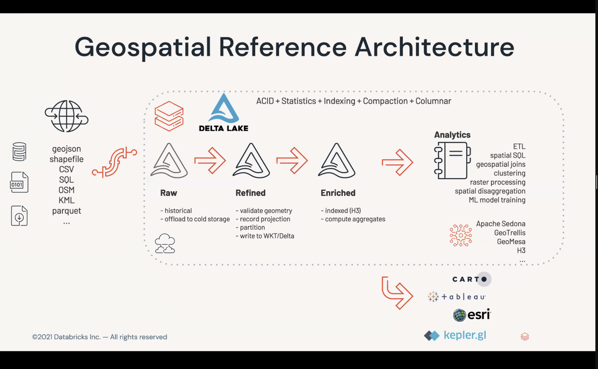

<!-- START doctoc generated TOC please keep comment here to allow auto update -->
<!-- DON'T EDIT THIS SECTION, INSTEAD RE-RUN doctoc TO UPDATE -->
**Table of Contents**  *generated with [DocToc](https://github.com/thlorenz/doctoc)*

- [Data Engineering, Databases, Data Structures, ML/DS](#data-engineering-databases-data-structures-mlds)
  - [Indexing, Pagecache, Storage Engines](#indexing-pagecache-storage-engines)
  - [Databases](#databases)
  - [Data Processing Systems](#data-processing-systems)
  - [Graph Processing and storage](#graph-processing-and-storage)
  - [Distributed Systems General](#distributed-systems-general)
    - [BlockChain Systems](#blockchain-systems)
    - [Cryptography](#cryptography)
  - [Cloud, Kubernetes, Deployment](#cloud-kubernetes-deployment)
  - [Data Structures/Sketches](#data-structuressketches)
  - [Algorithms](#algorithms)
    - [String Processing](#string-processing)
  - [OLAP, Aggregation](#olap-aggregation)
  - [ML and Data Science](#ml-and-data-science)
    - [Graph ML](#graph-ml)
    - [Time Series ML](#time-series-ml)
    - [Pattern Matching](#pattern-matching)
    - [Python/Pandas](#pythonpandas)
  - [Data Engineering](#data-engineering)
    - [Streaming Flows / Data Connectors](#streaming-flows--data-connectors)
    - [Geospatial / NearestNeighbor](#geospatial--nearestneighbor)
    - [Unstructured data](#unstructured-data)
  - [Public Data, Datasets, Data for Good](#public-data-datasets-data-for-good)
  - [Telemetry, Time Series, Tracing, Logging](#telemetry-time-series-tracing-logging)
  - [Compression, Data Storage](#compression-data-storage)
  - [I/O and Performance](#io-and-performance)
  - [Misc, Documentation, Etc](#misc-documentation-etc)
  - [Data Justice](#data-justice)

<!-- END doctoc generated TOC please keep comment here to allow auto update -->

# Data Engineering, Databases, Data Structures, ML/DS

## Indexing, Pagecache, Storage Engines

* [CasAB](https://www.researchgate.net/publication/232645611_CasAB_Building_Precise_Bitmap_Indices_via_Cascaded_Bloom_Filters) - using Cascaded Bloom Filters for space efficient bitmap indexing
* [Bw-Tree](https://www.microsoft.com/en-us/research/wp-content/uploads/2016/02/bw-tree-icde2013-final.pdf) and [LLAMA](https://www.microsoft.com/en-us/research/wp-content/uploads/2016/02/llama-vldb2013.pdf) - a new latch-free B-Tree design from Microsoft using delta-update / log-structured techniques and a hybrid latch-free page cache for high write throughput.  Really interesting set of papers for DB storage engine.
* [Memory Layouts for Binary Search](http://cglab.ca/~morin/misc/arraylayout/) shows that using BTrees might be faster than arrays due to CPU caching effects.
* [WiscKey](https://www.usenix.org/system/files/conference/fast16/fast16-papers-lu.pdf) - Splitting key and value storage for better efficiency/perf
* [Eyros](https://github.com/peermaps/eyros) - multi-dimensional interval database
* [Column Sketches](https://stratos.seas.harvard.edu/files/stratos/files/sketches.pdf) - using histogram and approximate/lossy encodings for really fast indexing/scanning.  Neat.  Does not require data clustering.

* [The Case for Learned Index Structure](https://ai.google/research/pubs/pub46518) - interesting paper from Google on using DL/ML/AI to create more efficient indexes
* [ALEX](https://dl.acm.org/doi/abs/10.1145/3318464.3389711) - an updatable learned index structure
* [PGM-index](https://pgm.di.unipi.it) - "Piecewise Geometric Model", a learned index, really neat.  However only for small keys, not strings
* [usort](https://github.com/sisudata/coloring/tree/master/usort) - fast radix/bucket sorting for integers, O(n) compared to quicksort-based O(n log n)
* [FM-Index](https://en.wikipedia.org/wiki/FM-index), a neat structure that allows for fast exact string indexing and counting while compressing original string data at the same time.  There is a Rust [crate](https://crates.io/crates/fm-index)
* [Pilosa](https://www.pilosa.com/docs/latest/data-model/) - A matrix bitmap index that can quickly answer queries about relationships between two dimensions, or billions of objects with millions of attributes.  “What attributes are the most common?”, “Which objects have these specific attributes?”, “What groups of attributes often appear together?”
  - Could be used for graph indexing for example
* [A+ Indexes: Tunable and Space-Efficient Adjacency Lists in Graph DBMS](https://arxiv.org/pdf/2004.00130.pdf) - could be super useful for building a Graph DBMS

* [S2](http://s2geometry.io) - Geometry/spatial index library
* [H3](https://eng.uber.com/h3/) - Uber's hexagonal hierarchical spatial index.

* [Lucene: The Good Parts](https://blog.parse.ly/post/1691/lucene/) - a great introduction to Lucene, terminology, indexing technology, search vs aggregations, etc.
* [Hyperscan](https://www.hyperscan.io) - Intel's high performance multiple regex matching library

## Databases

* [Immudb](https://github.com/codenotary/immudb?utm_source=gradientflow&utm_medium=newsletter&utm_campaign=issue36) - an "Immutable Database" that tracks every change/transaction ever done, and allows retrieving a history of any key. Like a log + merkle tree.
* [DuckDB](https://github.com/duckdb/duckdb) - An in-process SQL OLAP database.  Like H2/SQLite etc.  Super convenient, now used everywhere.
* [Doris](https://doris.apache.org) - a Clickhouse competitor for fast, MPP/SIMD columnar OLAP aggregations, but based on open data storage projects like Hudi and Iceberg

* [PostGraphile](https://github.com/graphile/postgraphile) - GraphQL on PostGres
* [CitusData](https://github.com/citusdata/citus) - Postgres extension for distributed tables and columnar storage!
* [YugabyteDB](https://www.yugabyte.com) - Another Postgres compatible distributed SQL database
* [EdgeDB](https://www.edgedb.com) - PostGres extension with EdgeQL, a succinct query language for much more concise common query patterns that would otherwise need subqueries

* [Databases in 2024: A Year in Review](https://www.cs.cmu.edu/~pavlo/blog/2025/01/2024-databases-retrospective.html) - really good summary of the landscape from Andy Pavlo

* [Pessimistic Cardinality Estimation](https://arxiv.org/pdf/2412.00642) - estimating query costs or upper bound on query output

## Data Processing Systems

A good [Map of incremental and streaming systems](https://scattered-thoughts.net/writing/an-opinionated-map-of-incremental-and-streaming-systems/) - organizing different systems in an ontology.

* [Procella](https://blog.acolyer.org/2019/09/11/procella/) - Google's new super-low-latency distributed SQL query engine to conquer all other query systems, using an innovative new columnar format
* [DataBend](https://github.com/databendlabs/databend) - open source cloud/on-prem data warehouse written in Rust
* [Timely Dataflow](https://github.com/TimelyDataflow/timely-dataflow) - distributed data-parallel compute engine in Rust, based on the [NAIAD](https://www.microsoft.com/en-us/research/wp-content/uploads/2013/11/naiad_sosp2013.pdf) paper
* [Arroyo](https://github.com/ArroyoSystems/arroyo) - Rust distributed stream processing engine, does codegen, using WASM.
* [Portals](https://people.kth.se/~jspenger/pdfs/spenger2022portals.pdf) - Dataflow Streaming for Stateful Serverless, using some actor concepts
* [How Rockset Separates Compute and Storage](https://rockset.com/blog/separate-compute-storage-rocksdb/) - techniques Rockset uses to achieve tight latencies even when compute and storage are separated
* [Aurora DSQL Architecture](https://brooker.co.za/blog/2024/12/04/inside-dsql.html) - really good look at Amazon's architecture to scale out compute, read and write throughput, and storage independently for an ACID OLTP database.  They push simple compute out to edges!

* [Improving the Presto Planner](https://prestodb.io/blog/2019/12/23/improve-presto-planner) - aggregation pushdowns in Presto, enabling better usage of DB sources that can handle aggregation
- [Lotus](https://github.com/guestrin-lab/lotus) - LLM powered structured and unstructured query engine

- [Aqua](https://aqua-language.github.io) - a new streaming dataflow language which compiles to Rust or Flink

Interesting domain-specific systems:

* [Lifestream](https://dl.acm.org/doi/pdf/10.1145/3445814.3446725) - a stream-processing system built for single-node, hospital/ICU environments
* [IOx](https://github.com/influxdata/influxdb_iox) - New in-memory columnar InfluxDB engine using Arrow, DataFusion, rust!  Persists using parquet.  Super awesome stuff.
* [Sneller](https://github.com/SnellerInc/sneller) - SQL for JSON at scale, using Zion as its backing format.  AVX512 assembly based.

## Graph Processing and storage

[Neo4J](https://neo4j.com) is the community leader of graph databases.  The amount of [visualization tools](https://neo4j.com/developer-blog/15-tools-for-visualizing-your-neo4j-graph-database/), plugins, and extras like [Graph Data Science](https://neo4j.com/developer/graph-data-science/) is really impressive.  However it costs $$.
* [neodash](https://github.com/nielsdejong/neodash) - build dashboards with Neo4J data
* [neomap](https://github.com/stellasia/neomap) for visualizing map data with x and y / lat/long points.  It's not very mature.
* [popoto](https://github.com/Nhogs/popoto/wiki/Getting-started) is a JS visualization framework specifically for Neo4J graph data and looks really slick.
* The built in neo4j-spatial OSM importer doesn't seem to work.  Might want to try [osm2graph Loader](https://github.com/Nhogs/popoto/wiki/Getting-started). Or just follow this Neo [blog post on neomap/GDS and OSM](https://medium.com/neo4j/visualizing-shortest-paths-with-neomap-0-4-0-and-the-neo4j-graph-data-science-plugin-18db92f680de).

Neo4J can be classified as an OLTP property graph database.  How we categorize graph DBs:
* Property graph (Neo4J, [ArangoDB](https://www.arangodb.com)) vs RDF triple (GraphDB, many others)
* OLTP (Neo4J, [ArangoDB](https://www.arangodb.com)) vs OLAP (AnzoGraph)
* OpenCypher (Neo4J, AgensGraph, [MemGraph](https://docs.memgraph.com), [NebulaGraph](https://nebula-graph.io)) vs SparQL([dgraph](https://dgraph.io)) vs other query languages ([ArangoDB](https://www.arangodb.com), Anzo, etc.)
* Geospatial support varies
* Tinkerpop and Gremlin is an old, mostly JVM-based standard for graph traversals but seems to be out of fashion and not much ongoing development, especially lacking is ML/AI support.
* There are also solutions that aren't quite databases like [DataWalk](https://datawalk.com/neo4jalternative/)

A good [summary of Graph DBs](https://docs.google.com/spreadsheets/d/1ribZq24cEzjVR0M3ZU0Tp2nKzkIpdwNSVPAtTsIvuUM/edit#gid=0).

* [PathQuery](https://arxiv.org/pdf/2106.09799.pdf) - Google's Graph Query Language

Overall what the graph world really needs is, instead of sticking everything into a giant GDBMS system, partitioning and federation, and composability -- think of it as a giant graph composed of subgraphs and even other DBMSes, Parquet files, data lakes/warehouses.

* [Quine.io](https://quine.io) is a streaming graph database, open source project of the year 2022!
* [YearOfTheGraph](https://yearofthegraph.xyz) - great resources site / newsletter about graph processing, graph ML, graph DBs, etc.
* [Graph Thinking](https://medium.com/knowledge-technologies/graph-thinking-5e9c85134ab0) - Paco's overview of how AI and learning systems interact with graphs and why graph thinking is key to the future of AI.

* [SQLGraph](https://static.googleusercontent.com/media/research.google.com/en//pubs/archive/43287.pdf) - An efficient Relational-Based Property Graph Store
* [Graph Processing in Main-Memory Column Stores](https://tud.qucosa.de/api/qucosa%3A30306/attachment/ATT-0/)
* [LevelGraph](https://www.vldb.org/pvldb/vol9/p1469-maccioni.pdf) - Graph database in the browser

## Distributed Systems General

Some good intro resources:
* [Distributes systems theory for the distributed sys engineer](https://www.the-paper-trail.org/post/2014-08-09-distributed-systems-theory-for-the-distributed-systems-engineer/)

* [Viewstamped Replication](http://pmg.csail.mit.edu/papers/vr-revisited.pdf) - classic paper by Barbara Liskov
* [CRUSH](https://ceph.com/wp-content/uploads/2016/08/weil-crush-sc06.pdf) - Controlled Replication Under Scalable Hashing - Ceph's algorithm for balancing decentralized object placement with minimal data movement in a storage cluster
* [CALM](https://arxiv.org/abs/1901.01930) - "Consistency as Logical Monotonicity" theorem proves when distributed systems can have consistent, coordination-free behavior.
* [Don't Get Stuck in the CON game](https://pathelland.substack.com/p/dont-get-stuck-in-the-con-game-v2?utm_medium=email&utm_campaign=cta) - Excellent Pat Helland post about CONsistency, CONvergence, CONfluence, why "consistency" is so meaningless, and where things are going
* [Fast, Flexible PAXOS](https://hh360.user.srcf.net/blog/2020/11/fast-flexible-paxos/) - how to get around the leader bottleneck and exchange leader election consensus for less replication
* [Hermes Protocol](https://hermes-protocol.com) - "A fast, fault-tolerant & linearizable replication protocol"
* [Read-Write Quorum Systems Made Practical](https://mwhittaker.github.io/publications/quoracle.pdf) - is majority quorum always needed? Tradeoffs and how to achieve lower latency with different quorum configs
* [Compartmentalized MultiPaxos](https://mwhittaker.github.io/publications/compartmentalized_paxos.pdf)
* [CRAQ](https://timilearning.com/posts/mit-6.824/lecture-9-craq/) - Chain Replication with Apportioned Queries - allowing reads on multiple replicas along the chain to increase read bandwidth while maintaining advantages of chained replication
* DataDog's article on using [formal modeling and lightweight simulations](https://www.datadoghq.com/blog/engineering/formal-modeling-and-simulation/) to verify the correctness of a new distributed system.  Really neat process.

* [Making CRDTs Byzantine Fault Tolerant](https://martin.kleppmann.com/papers/bft-crdt-papoc22.pdf) - really interesting

* [10000 Akka Cluster Nodes and RAPID](https://manuel.bernhardt.io/2020/04/30/10000-node-cluster-with-akka-and-rapid/) - interesting view into the new RAPID cluster membership protocol and how it can scale out peer to peer clusters
* [Local-first Cooperation](
* https://local-first-cooperation.github.io/website/#relationship-with-other-architectural-building-blocks) - a pattern of distributed resilience by having local groups cooperate without centralized coordination.  Also talks about Reactive.
  - Not strictly about distributed systems, but related (hint: CRDTs are foundational)s: [Local-First Software Development](https://www.inkandswitch.com/local-first/)
* [Five-Minute Rule for the Cloud: Caching in Analytics Systems](http://andrew.nerdnetworks.org/other/CIDR_2025_Cloud_5_Minute_Rule.pdf) - summary of cost model for cloud object store based analytics and
  at what point it is "worth it" to cache

### BlockChain Systems

Starting material:
* [Web3/Crypto: Why Bother?](https://continuations.com/post/671863718643105792/web3crypto-why-bother) - a great read, why web3 and decentralization matters
* [A Normie's Guide to Becoming a Crypto Person](https://nymag.com/intelligencer/article/crypto-nft-twitter-discord-guide.html) - all about lexicon, scenes, coins, who to follow, how to socialize in the Crypto world.  Some great links to reading, including [Fat Protocols](https://www.usv.com/writing/2016/08/fat-protocols/), on why tokens inverts financial incentives and breaks the top heavy data centralization mold of the current Internet.
* [How does Bitcoin actually work?](https://www.youtube.com/watch?v=bBC-nXj3Ng4) - A great, short (25 min) video summarizing blockchain and crypto tech
* Andreessen Horowitz's [Crypto Cannon](https://a16z.com/2018/02/10/crypto-readings-resources/) - huge list of reading and resources
* ACM's [Core Concepts, Challenges, and Future Directions in Blockchain](https://dl.acm.org/doi/fullHtml/10.1145/3366370) - technical intro for CS folks
* MIT's [Video Lectures on Blockchain and Money](https://ocw.mit.edu/courses/sloan-school-of-management/15-s12-blockchain-and-money-fall-2018/video-lectures/)

Web3/Interesting Chains:
* [Arweave](https://www.arweave.org) - Permanent archival data storage based on web3/blockchain principles

Papers:
* [GossipSub](https://arxiv.org/pdf/2007.02754.pdf) - Attack-resistant peer-to-peer message propagation in ETH2.0 etc
* [Narwhal and Tusk](https://arxiv.org/pdf/2105.11827.pdf) - DAG-based MemPool and Efficient BFT Consensus
* [FastPay](https://arxiv.org/pdf/2003.11506.pdf) - High-performance byzantine Fault-Tolerant Settlement
* [Move](https://diem-developers-components.netlify.app/papers/diem-move-a-language-with-programmable-resources/2020-05-26.pdf) - Smart contract language with notion of non-copyable resources (such as money)

Contracts, Programming, Storage etc.
* [CosmWasm](https://docs.cosmwasm.com/docs/1.0/) - Rust/WASM for programming smart contract on Cosmos ecosystem

* [Lifecycle of a Transaction](https://hackmd.io/@huitseeker/rJG_kA0LK) - great summary from @huitseeker on blockchain transaction dataflow
* [Increasing Scalability of the EVM](https://forum.celestia.org/t/increasing-scalability-of-the-evm-for-rollups-by-restricting-state-and-contract-set/78) - summary of potential performance improvements
* [The AMM Test](https://medium.com/dragonfly-research/the-amm-test-a-no-bs-look-at-l1-performance-4c8c2129d581) - "A No BS Look at L1 Performance" good discussion on L1 performance for serialized swap transactions
* [Vitalik Buterin](https://vitalik.ca/index.html) is a leading blockchain person and has a ton of great writings.
  * [Using Blockchain for Voting](https://vitalik.ca/general/2021/05/25/voting2.html)
  * [Crypto Cities](https://vitalik.ca/general/2021/10/31/cities.html) - super cool ideas for using blockchain to make government more transparent, efficient, and verifiable
  * [An Incomplete Guide to Rollups](https://vitalik.ca/general/2021/01/05/rollup.html)
  * [Limits to Blockchain Scalability](https://vitalik.ca/general/2021/05/23/scaling.html)
  * [Why Proof of Stake](https://vitalik.ca/general/2020/11/06/pos2020.html)

Blockchain has many detractors and critiques.  [Why NFTs are bad](https://antsstyle.medium.com/why-nfts-are-bad-the-long-version-2c16dae145e2#c79c) has very high-level overviews of how blockchains and NFTs work, and sketches of why they don't work.  It's good for understanding many of the arguments against.  Responses from Francois:
- On security and 51% problem: PoS is not less secure (?), and getting a majority (67% in newer systems) does not just let you control the blockchain.  Consensus = ordering and selection of transactions, not validation
- Concentration of wealth and how to incentivize validators (who get more tokens) is the primary problem.  See Fanti's papers on [Compounding of Weath in PoS](https://fc19.ifca.ai/preproceedings/161-preproceedings.pdf) for solutions that avoid concentration of wealth.
- Sharding does not mean you can take over a shard by controlling a majority of shards nodes.  Still need consensus.
- Having more users who run nodes is the best counterbalance against Pos/PoW concentration.

### Cryptography

* [BLS Signatures: Better than Schnorr](https://medium.com/cryptoadvance/bls-signatures-better-than-schnorr-5a7fe30ea716) - BLS signatures allow aggregation of multiple signatures into one

## Cloud, Kubernetes, Deployment

* [OpenEBS](https://openebs.io) - fast, configurable, elastic block/local storage on any cloud platform running Kube
* [Kubernetes Liveness and Readiness Probes](https://blog.colinbreck.com/kubernetes-liveness-and-readiness-probes-how-to-avoid-shooting-yourself-in-the-foot/) - how to avoid shooting yourself in the foot
* [Armada - Running Millions of Batch Jobs on K8s](https://www.gresearch.co.uk/article/armada-how-to-run-millions-of-batch-jobs-over-thousands-of-compute-nodes-using-kubernetes/)
* [Garage](https://garagehq.deuxfleurs.fr) - S3 compatible distributed storage solution, like Minio but supposedly faster
* [Colima](https://github.com/abiosoft/colima) - MacOS based container runtime, could be a good alternative to Docker runtime

* [Scaphandre](https://github.com/hubblo-org/scaphandre) - Metrics agent for collecting power consumption metrics!

* [Storage is the Achilles Heel of Containers](https://blog.usejournal.com/storage-is-the-achilles-heel-of-containers-97d0341e8d87) - a good overview of the storage landscape for containerized cloud applications

* [POSH](https://github.com/deeptir18/posh) - a shell for running awk/grep/sed etc on remote cloud storage

If you're on Azure, check out [Kubelogin](https://github.com/Azure/kubelogin) - a utility to ensure keepalive of Azure Kube Service credentials.

## Data Structures/Sketches

* [Adaptive Radix Trees](http://www-db.in.tum.de/~leis/papers/ART.pdf) - cache friendly indexing for in-memory databases
    - [Java implementation](https://github.com/rohansuri/adaptive-radix-tree/blob/master/README.md)
    - [Rust congee](https://crates.io/crates/congee) - Concurrent ART based on Optimistic Lock Coupling
* [HAT-Trie](https://tessil.github.io//2017/06/22/hat-trie.html) - a cache concious trie
* [PH-Tree](https://github.com/tzaeschke/phtree/raw/master/PH-Tree-v1.1-2014-06-28.pdf) - A (spatial?) Patricia-trie combined with Hypercubes for multidimensional indexing and efficient data storage
* [Prolly Trees](https://docs.dolthub.com/architecture/storage-engine/prolly-tree) - "Probabilistic B-Tree" with fast diffs and structural sharing.  Good for versioning and immutable maps where minimizing space across versions is important.
* [Optimistic Lock Coupling](http://sites.computer.org/debull/A19mar/p73.pdf) - scalable and efficient general-purpose synchronization by using a version counter and checking after reads

* [Counting Quotient Filters](https://blog.acolyer.org/2017/08/08/a-general-purpose-counting-filter-making-every-bit-count/) - much faster at updating and search than Bloom filters, and can count too!  An [implementation in C](https://github.com/vedantk/quotient-filter) exists.
* [Moment-based Quantile Sketches](http://www.bailis.org/papers/moments-vldb2018.pdf) - a paper out of Stanford offering highly efficient alternative to T-Digests for quantile sketches.  Also [repo](https://github.com/stanford-futuredata/momentsketch)
* [DDSketch](https://blog.acolyer.org/2019/09/06/ddsketch/) - "a fast and fully-mergeable quantile sketch with relative-error guarantees"
    - Our research shows DDSketch may use many more buckets than TDigest, but merges much much faster and provides stricter error guarantees.  Memory diff might not be that big in reality as TDigest needs a tree structure.
* [SmoothieMap2](https://medium.com/@leventov/smoothiemap-2-the-lowest-memory-hash-table-ever-6bebd06780a3) - a low-memory implementation of Google SwissTable for the JVM
* [Efficient Set Reconciliation without Prior Context](https://www.ics.uci.edu/~eppstein/pubs/EppGooUye-SIGCOMM-11.pdf) - Invertible Bloom Filters that allow set difference to be computed/exchanged between two parties using only the size of the difference to be exchanged, not the entire set

* [Efficient Computation of Frequent and Top-K Elements in Data Streams](https://www.cs.ucsb.edu/sites/default/files/docs/reports/2005-23.pdf) - a great overview of techniques, including sketches

* [XXH3 - a Speed-Optimized Hashing Algo](http://fastcompression.blogspot.com/2019/03/presenting-xxh3.html) - neat insights into the evolution of hashing, improvements using vectorization, and more!

Interesting data structures from the blockchain world:
* [Utreexo](https://dci.mit.edu/research/2019/6/6/utreexo-a-dynamic-hash-based-accumulator-optimized-for-the-bitcoin-utxo-set) - a "hash-based accumulator", basically a set of merkle trees that allows fast updating

## Algorithms
### String Processing

* [Smart String Processing Algos in Clickhouse](https://geeks-world.github.io/articles/466183/index.html) - def worth a read for string/substr search
    - Somebody's Java experiment on above https://gist.github.com/jexp/825280
* [Beating Textbook Algorithms in String Search](https://medium.com/wix-engineering/beating-textbook-algorithms-in-string-search-5d24b2f1bbd0) - great discussion of Knuth-Morris-Pratt, Aho-Corasick, and other basic string search algorithms

## OLAP, Aggregation

* [Scalable In-memory Aggregation](http://www.doc.ic.ac.uk/teaching/distinguished-projects/2011/r.kopaczyk.pdf) - column-oriented, in memory with bitmap indexing and memoization
* [Nanocubes](http://getprismatic.com/story/1413038758684?share=MzAxNDE.MTQxMzAzODc1ODY4NA.QfCHBvwG6MuLbubytTgXqm0gn4w) - Fast visualization of large spatiotemporal datasets.  Amazing stuff.  [Paper](http://nanocubes.net/assets/pdf/nanocubes_paper.pdf) and [Github repo](https://github.com/laurolins/nanocube).
* [Quotient Cubes](http://www.vldb.org/conf/2002/S22P02.pdf) - semantic grouping and rollup algorithm for OLAP cubes.  [Ruby implementation](https://github.com/besquared/quotient-cube).
* [Top K queries and cubes](http://www1.se.cuhk.edu.hk/~hcheng/paper/vldb06_rankcube.pdf)

## ML and Data Science

* [Visual Introduction to Machine Learning](http://www.r2d3.us/visual-intro-to-machine-learning-part-1/) - beautiful and a quick read, using D3 animation
* [LearnDS](http://learnds.com) - A set of IPython notebooks for learning data science
* [Machine Learning for developers](http://xyclade.github.io/MachineLearning/)
* [Cognitive Database](https://arxiv.org/pdf/1712.07199.pdf) - Using NLP word embedding techniques to add cognitive, ML/AI capabilities to SQL queries of RDBMSes
* [Useful Resources for DS](https://community.ibm.com/community/user/datascience/blogs/paco-nathan/2019/05/09/useful-resources-for-data-science) by Paco Nathan.  Good list!
* [Applied ML in Production](https://github.com/eugeneyan/applied-ml) - a great list of projects, blogs, etc. by actual companies
* [The Illustrated Word2vec](https://jalammar.github.io/illustrated-word2vec/) - an EXCELLENT guide with many illustrations to word2vec, and using vectors to represent, analyze, and compare words, people, and other things

* [Getting Started in Data Science](https://gumroad.com/l/getting-started-in-data-science) book with great math intro
* [A Tour of Machine Learning Algorithms](https://machinelearningmastery.com/a-tour-of-machine-learning-algorithms/)
* [Teach Your Kids To Code](http://teachyourkidstocode.com) - learning Python for kids

* [StreamLit](https://streamlit.io/gallery) - a visualization/dashboard/data app tool for presenting data
* [HiPlot](https://github.com/facebookresearch/hiplot) - High-dimensional data plotting

* [The Case for Rho Calculus in AI](https://hackernoon.com/the-case-for-rho-calculus-in-ai) - fascinating look at how Rho Calculus (code vs data vs computation, and the use of computation to morph or alter code, thus altering behavior based on introspection) is important for AI, and how concurrent computation (eg mobile devices) affects things

### Graph ML

* [Node Embeddings for Beginners](https://towardsdatascience.com/node-embeddings-for-beginners-554ab1625d98#:~:text=Node%20embeddings%20are%20a%20way,in%20machine%20learning%20prediction%20tasks) - How can we do ML on Graphs?  Turning graphs into vectors for ML
* [Graph Intelligence](https://gradientflow.com/what-is-graph-intelligence/) - a good summary of graph ML stack, technologies, and approaches from Ben Lorica.  It's interesting that companies are leveraging big data platforms and bypassing graph DBs to lower cost and reuse existing investments.

### Time Series ML

* [LSTM Neural Networks for Anomaly Detection](https://medium.com/datadriveninvestor/lstm-neural-networks-for-anomaly-detection-4328cb9b6e27) - really relevant to time series analysis
* [Machine Learning for Predictive Maintenance](https://medium.com/bigdatarepublic/machine-learning-for-predictive-maintenance-where-to-start-5f3b7586acfb)
* [Autoencoders for Stock-Market Time Series Compression](https://towardsdatascience.com/autoencoders-for-the-compression-of-stock-market-data-28e8c1a2da3e)
* [Beginner's Guide to LSTMs and RNNs](https://skymind.ai/wiki/lstm) from Skymind
* [Quantifying Time-Series Synchrony](https://towardsdatascience.com/four-ways-to-quantify-synchrony-between-time-series-data-b99136c4a9c9) - using Pearson correlation, Time-Lagged Cross-Correlation (TLCC), Dynamic Time Warping....
* [Complete Guide to Time Series Forecasting](https://towardsdatascience.com/the-complete-guide-to-time-series-analysis-and-forecasting-70d476bfe775)
* [Anomaly Detection with Prometheus](http://events19.linuxfoundation.org/wp-content/uploads/2017/12/AIOps-Anomaly-Detection-with-Prometheus-Marcel-Hild-Red-Hat.pdf)
* [Intro to Isolation Forests](https://ruivieira.github.io/introduction-to-isolation-forests.html)
* [DeepSketch](https://www.vldb.org/pvldb/vol17/p4369-crotty.pdf) - A Query Sketching Interface for Deep Time series Similarity Search

### Pattern Matching

* [Cayuga](https://www.khoury.northeastern.edu/home/mirek/papers/2007-CIDR-CayugaImp.pdf) - a "General Purpose Event Monitoring System" with an algebra for expressing complex event patterns

* [Pattern Search with Knuth-Morris-Pratt (KMP) Algorithm](https://towardsdatascience.com/pattern-search-with-the-knuth-morris-pratt-kmp-algorithm-8562407dba5b)
* [Aho-Corasick Algorthm](https://www.geeksforgeeks.org/aho-corasick-algorithm-pattern-searching/) for searching multiple words at the same time

Other:
* [Swarm Intelligence](https://appliednetsci.springeropen.com/articles/10.1007/s41109-020-00260-8)
* [Learning to Fly](https://pwy.io/en/posts/learning-to-fly-pt1/) - blog on simulating evolution using genetic algorithms in Rust, with a great explanation of the use of neural networks and deep learning to model brains

### Python/Pandas

* [Vaex](https://github.com/vaexio/vaex) - "out of core" Pandas for big data, using memory mapping, zero-copy, volume visualization
* [Modin](https://github.com/modin-project/modin) - wrapper for Pandas to transparently wrap Ray/Dask and other more scalable backends to speed things up
* [PySpark vs Dask vs Vaex etc](https://towardsdatascience.com/beyond-pandas-spark-dask-vaex-and-other-big-data-technologies-battling-head-to-head-a453a1f8cc13) - interesting comparison of diff frameworks for big data analysis via Pandas API.
* [polars](https://github.com/pola-rs/polars) - super fast and high level DataFrame implementation for both Rust and Python, much faster and higher level than using Arrow itself

Kedro is a good framework for standardizing processing pipelines.

* [PyOxidizer](https://pyoxidizer.readthedocs.io/en/stable/) - a Rust tool to package Python apps, interpreter, and all dependencies as a single binary, by wrapping app in a Rust program with a custom Rust Py module importer.  Also helps embed Python code in Rust apps.

* [PyOD](https://github.com/yzhao062/Pyod#implemented-algorithms) - outlier detection library
* [ADTs in Python](http://blog.ezyang.com/2020/10/idiomatic-algebraic-data-types-in-python-with-dataclasses-and-union/)

* [Oh no, my data science is getting Rusty!](https://www.crowdstrike.com/blog/data-science-test-drive-of-rust-programming-language/) - neat post from CrowdStrike on integrating Rust with Python for improved performance AND safety

## Data Engineering

Data organization, versioning, abstractions, frameworks, workflow/process tools

[Kedro](https://github.com/quantumblacklabs/kedro) is a great framework for writing DS and DE pipelines.
* [knowledge-repo](https://github.com/airbnb/knowledge-repo) - AirBNB's example of a "knowledge repo", sharing common scripts and modules for handling data, promoting reuse and reducing tech debt for DS/DE
* [dvc](https://dvc.org/doc/use-cases/versioning-data-and-model-files/tutorial) is a library and CLI for git-like versioning of datasets, models, etc. - but can leverage cloud storage like S3
* [Pachyderm](https://www.pachyderm.com/getting-started/) is an entire platform for versioning and DS workflow - like DVC on steroids
* [FBLearner Flow](https://engineering.fb.com/2016/05/09/core-data/introducing-fblearner-flow-facebook-s-ai-backbone/) - Facebook's ML experimentation and workflow platform.  They have "operators" which can parallelize work.
* [Dagster](https://dagster.io) - Data Eng and workflow orchestrator, supports streaming
* [Argo Workflows](https://argo-workflows.readthedocs.io/en/latest/) - K8s native workflow orchestrator

* [Dali](https://github.com/linkedin/dali) - LinkedIn's data access layer, which can present unified views of datasets to consumers and protect against data producer versioning changes.  See the [blog post](https://engineering.linkedin.com/blog/2017/11/dali-views--functions-as-a-service-for-big-data).
* [Data Discovery - The Future of Data Catalogs for Data Lakes](https://towardsdatascience.com/data-discovery-the-future-of-data-catalogs-for-data-lakes-7b50e2e8cb28) - dynamic discovery using ML and why its better than static catalogs

* [kube-batch](https://github.com/kubernetes-sigs/kube-batch) - advanced batch job scheduler for Kubernetes, multi-tenant

* [owl-data-sanitizer](https://towardsdatascience.com/introducing-a-new-pysparks-library-owl-data-sanitizer-bcc46e1583e6) - PySpark based data quality/validation library, featuring YAML/SQL-based configurable data rules and error/data comparison reports generation

* [Herbie](https://herbie.uwplse.org) is a tool to help find/fix inaccurate floating point expressions

Sometimes it's about how you organize data teams.
* [Data Mesh](https://www.bigdatarepublic.nl/articles/two-steps-towards-modern-data-platform/) is a really good concept.  Have embedded data engineers in each team plus a data platform team to provide common infra/tools/services.

Interesting development:
* [Enso](https://enso.org/language) -- a new graphical language running on GraalVM tying together data workflows, Python, R, Java?
* [PRQL](https://prql-lang.org) - a more modern, pipelined SQL dialect with native Clickhouse and other support

### Streaming Flows / Data Connectors

* [AirByte](https://airbyte.io) - Open-source data integration/easy ELT pipelines
* [Benthos](https://github.com/redpanda-data/benthos/) and [RedPanda connect](https://github.com/redpanda-data/connect) - easy declarative (YAML) stream connectors and processors
* [FluentBit](https://fluentbit.io) - CNCF standard for observability data connector/processor/forwarder
* Apache Nifi - but its outdated
* [Dagster](https://dagster.io) - Data Eng and workflow orchestrator, supports streaming

### Geospatial / NearestNeighbor

* [Pelias](https://www.pelias.io) - Free geocoder.  Return list of places near lat/long.  Could be super useful for geospatial apps.
* [H3](https://eng.uber.com/h3/) - Uber's hexagonal hierarchical spatial index.
* Speaking of hexagons, [Hexagonal Grids](https://www.redblobgames.com/grids/hexagons/) is a great writeup on hexagonal grid systems and many many details
  - [Efficient, self-mapping Algorithm for Hexagon-Based Gridding](http://www.jatit.org/volumes/Vol98No17/9Vol98No17.pdf)
* [Sedona](http://sedona.apache.org/tutorial/rdd/) - Apache project providing first class spatial processing for Spark, including SQL operators such as ST_Contains() etc.!
* [Valhalla](https://github.com/valhalla/valhalla) - OpenStreetMap based routing and map-matching engine.  Designed to run as a server and has Docker container, should be easy to get up and running.
  * Accompanying article on [Map-Matching Done Right using Valhalla Meili](https://towardsdatascience.com/map-matching-done-right-using-valhallas-meili-f635ebd17053)
* [Fast Map Matching](https://fmm-wiki.github.io) - but it's really hard to compile
* [Eyros](https://github.com/peermaps/eyros) - multi-dimensional interval database

Usually, geospatial and NN indexing is done with tree-based structures such as R-trees.  However, there are a spate of new algorithms. Here is a good [overview of HNSWG](https://www.arxiv-vanity.com/papers/1904.02077/) or "Hierarchical Navigable Small-World Graphs", using multi layered graphs to answer the k-NN problem -- as well as related algorithms.  There is also a [github repo](https://github.com/nmslib/hnswlib).

From Databrick's Spark Geospatial Webinar: reference architecture and data flow for geospatial:

### Unstructured data

* [Fastdup](https://github.com/visual-layer/fastdup) - from the Turo team at Apple, a fast Python library for image dedup, anomalies, clustering, and other ML insights and analysis
* [k2](https://github.com/k2-fsa/k2) - deep learning audio/speech recognition
* [Lhotse](https://lhotse.readthedocs.io/en/latest/getting-started.html) - speech processing
* [Whisper](https://towardsdatascience.com/whisper-transcribe-translate-audio-files-with-human-level-performance-df044499877) - transcribe audio files "with human-level performance"

Note that one of the intersections of ML, unstructured data, and nearest neighbor has to do with vector search and vector databases.  You turn unstrutured data, say images, into a set of vectors.  Then, you can use vector similarity algorithms or databases to look up an image similar to another image.  This is a neat and up-and-coming category of data products for AI/ML.

* [Weaviate](https://github.com/semi-technologies/weaviate) - an open source vector database and similarity search engine

## Public Data, Datasets, Data for Good

* [Best free, open data sources](https://www.freecodecamp.org/news/https-medium-freecodecamp-org-best-free-open-data-sources-anyone-can-use-a65b514b0f2d/)
* [Our World in Data / COVID](https://ourworldindata.org/coronavirus) - Really neat site with stats tracking COVID cases, you can custom select countries to compare etc.
* [Global COVID Index](https://covid19.pemandu.org/) - comparative map showing different COVID measurements globally
* [Earth Science Information Partners](https://www.esipfed.org/about)

* [Public Policy Analysis: Data Science in Government](https://urbanspatial.github.io/PublicPolicyAnalytics/) - free book on geospatial analysis and DS in government planning
* [Finding Clusters of NYPD Officers in CCRB Compliant Data](https://ejfox.com/blog/nypd-ccrb-complaint-clusters/?mkt_tok=NzEwLVJSQy0zMzUAAAF-bcHIkeWlkYopqQVlTiQ2HCpocRBU6_ipCAMiQ18l1yLcadDLh83QErIBjTWRX163QbqtqNupfJC4AQqMHBGp4H1r0i1C-wnpAyz7WprlYFgK) - an AWESOME study using graphs, Neo4J, and public data to analyze NYPD officers complicity in the light of George Floyd police brutality.  Excellent visualizations too.

## Telemetry, Time Series, Tracing, Logging

* [Box of Pain](http://pmg.csail.mit.edu/papers/vr-revisited.pdf) - injection of faults and delays together with tracing for evolved insights
* [Chaos Mesh](https://github.com/chaos-mesh/chaos-mesh) - Cloud native (ie Kubernetes-integrated) chaos engineering/injection system!
* [Hastic](https://hastic.io) - Anomaly detection plugin for Grafana/TSDBs
* [Static Code Analysis for Log Parsing](https://medium.com/palantir/using-static-code-analysis-to-improve-log-parsing-18f0d1843965) - turning unstructured to structured logs
* [Canopy](https://research.fb.com/wp-content/uploads/2017/10/sosp17-final14.pdf?) - Facebook's End to End Tracing and Analysis System
* [Apache Skywalking](https://skywalking.apache.org) - APM for distributed systems
* [FluentBit](https://fluentbit.io) - CNCF standard for observability data connector/processor/forwarder
* [BTrDB] - Berkeley Tree DataBase, "a next-gen timeseries database for dense, streaming telemetry", claims more than 10 million inserted values/sec/node
* [Correlating Signals Efficiently in Modern Observability](https://www.bwplotka.dev/2021/correlations-exemplars/) - great article on how to correlate traces, logs, with metrics, using exemplars
* [JSON Tiles](https://db.in.tum.de//~durner/papers/json-tiles-sigmod21.pdf) - storage format for fast analytics on semi-structured data.  Columnar optimization techniques.
* [Zion](https://sneller.ai/blog/zion-format/) - Sneller's format for JSON like data: hash JSON fields into 16 ion "buckets" and separately zstd-compress them.  Pretty brilliant.

Scalyr has a bunch of cool blog posts about how they do fast log/event searching:
* [How Scalyr Works](https://www.scalyr.com/help/how-scalyr-works) talks about log pre-aggregation using a 60 second buffer, and
* [Searching 1.5TB/Sec](https://www.scalyr.com/blog/searching-1tb-sec-systems-engineering-before-algorithms/) - using brute force to search huge amounts of data
* [pq](https://github.com/iximiuz/pq) - Parse and Query log files as time series, extracting structured records out of common log files
* [MinSQL](https://github.com/minio/minsql/blob/master/README.md) - interesting POC on lightweight SQL based log search, w automatic field parsing etc.

* [Husky - Datadog's Third Gen Event Store](https://www.datadoghq.com/blog/engineering/introducing-husky/) - really interesting read on how Datadog's event/log storage architecture evolved over the years
* [Bitdrift Capture](https://blog.bitdrift.io/post/honey-i-shrunk-the-telemetry) - decentralized telemetry at the edge with "distributed search" - absolutely brilliant.  This is the way!
* [Tremor](https://docs.tremor.rs) - a simple event processing / log and metric processing and forwarding system, with scripting and streaming query support.  Much more capable than Telegraf.
* [Graph coloring for Machine Learning](https://sisu.ai/blog/graph-coloring-for-machine-learning) - column reduction using approximate coloring techniques

## Compression, Data Storage

* [TurboTranspose](https://github.com/powturbo/Turbo-Transpose) - Transpose: SIMD Integer+Floating Point Compression Filter.  With lots of links to floating point compression algorithms.
* [zfp](https://computing.llnl.gov/projects/zfp) - compressed floating-point / integer arrays that allow random access?

* [BtrBlocks](https://www.cs.cit.tum.de/fileadmin/w00cfj/dis/papers/btrblocks.pdf) - a novel columnar format, a Parquet competitor, which uses some new encoding techniques including frequency and "FSST" and a novel floating point encoding - to achieve much better scan throughput than Parquet without using standard compression like ZSTD
* [Vortex](https://docs.vortex.dev) - next generation file format, supports random access to columnar compressed data, zero-copy on read, many of the same concepts I pioneered in compressed-vec
* [VelocyPack](https://github.com/arangodb/velocypack#readme) - compact and fast JSON storage and serialization, used in [ArangoDB](https://www.arangodb.com)
* [Amazon Ion](https://amzn.github.io/ion-docs/guides/why.html#read-optimized-binary-format) - really interesting MsgPack/CBOR like serialization format from Amazon.  Binary format supposed to be very compact even uncompressed, half the size of JSON, and is designed to be read-optimized with provisions for rapidly skipping to the field one wants. Also has "symbol table" support.
* [Zion - Columnar Compression Without Columns](https://sneller.ai/blog/zion-format/) - Sneller's format for JSON like data: hash JSON fields into 16 ion "buckets" and separately zstd-compress them.  Pretty brilliant.
* [JSON Tiles](https://db.in.tum.de//~durner/papers/json-tiles-sigmod21.pdf) - storage format for fast analytics on semi-structured data.  Columnar optimization techniques.
* [Lance](https://crates.io/crates/lance-datagen) - "Modern columnar data format for ML"

* [Context-Tree Weighting](https://citeseerx.ist.psu.edu/viewdoc/download?doi=10.1.1.109.1872&rep=rep1&type=pdf) - a technique for data compression and graph/tree representation.  Warning, paper is very dense.

## I/O and Performance

* [ScyllaDB and I/O Access Methods](https://www.scylladb.com/2017/10/05/io-access-methods-scylla/) - discussions of mmap vs AIO/DIO vs standard Linux I/O
* [Direct I/O Writes](https://itnext.io/direct-i-o-writes-the-best-way-to-improve-your-credit-score-bd6c19cdfe46) - why doing direct I/O writes may end up better than buffered
* [Diskplorer](https://github.com/scylladb/diskplorer) - a tool for doing load testing on disks, graphing IOPS vs bandwidth and latency.  With lots of great graphs on different types of hardware and cloud setups.
* [Are You Sure You Want to Use MMAP?](https://db.cs.cmu.edu/papers/2022/cidr2022-p13-crotty.pdf) - a review of performance and correctness issues with use of MMAP in DBMSes

[Conbench](https://conbench.ursa.dev) is a Continuous Benchmarking tool.

Programming Langauges/DSLs/etc.:
* Mojo - Chris Lattner's new language for fast AI/ML based on Python
* [Halide](https://github.com/halide/Halide) is a neat language for image/array processing that has a unique way of specifying how low-level operations should be parallelized and optimized (a spec for How) while separating out the what, without needing users to get into super ugly SIMD/GPU code.  Kind of like faster crate in Rust.
* [Taichi](https://github.com/taichi-dev/taichi?tab=readme-ov-file) - "parallel programming language for high-performance numerical computation" based on Python

## Misc, Documentation, Etc

* [manim](https://docs.manim.community/en/stable/examples.html) - Math animation defined easily using Python

## Data Justice

https://journals.sagepub.com/doi/10.1177/2053951717736335

